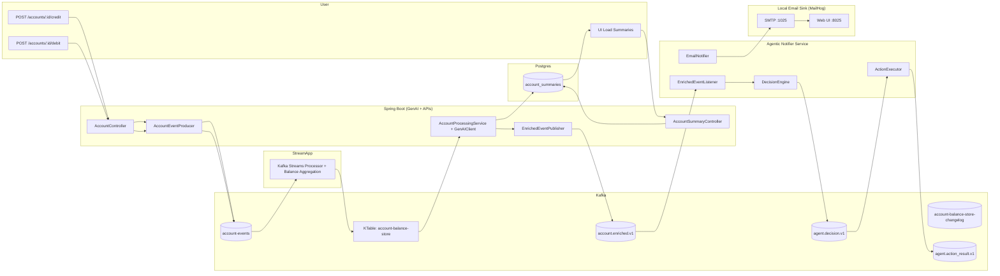
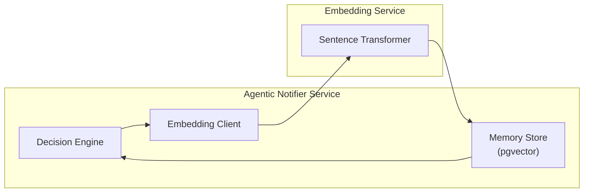

[](https://github.com/renatosviana/agentic-kafka-reference-architecture/actions/workflows/ci.yml)
👋 If this architecture helped you, please ⭐ the repo or open a Discussion with questions or feedback.

# Agentic Kafka Reference Architecture

## What this is
A production-style reference architecture combining:
- Event-driven microservices (Kafka)
- GenAI (LLM-based reasoning)
- Agentic workflows
- Java + Spring Boot

## Why this exists
Most GenAI examples ignore:
- Throughput
- Idempotency
- Schema evolution
- Streaming consistency

This project shows how to do GenAI *at scale*.

## What problem this solves
This reference architecture shows how to combine Kafka event streaming with GenAI enrichment and an agentic decision layer, producing auditable decisions and observable actions (email notifications) using Spring Boot, Kafka Streams, and local-first tooling.

## Architecture
### Architecture Diagram




### Agentic Memory Flow


## Quick Start (Local Docker Compose)

**Prerequisites**

- Docker Desktop (Docker Compose v2)
- Git
- An OpenAI API key (stored locally in .env, not committed) -- see [OpenAI / GenAI Setup](https://github.com/renatosviana/agentic-kafka-reference-architecture/tree/main/kafka-avro-genai-streaming-poc#openai--genai-setup)

### 1. Clone the repository

```bash
git clone https://github.com/renatosviana/agentic-kafka-reference-architecture.git
cd agentic-kafka-reference-architecture
```
### 2. Create local environment file

```bash
OPENAI_API_KEY=sk-xxxx
```

⚠️ .env is gitignored and must never be committed.

### 3. Start the full stack

```bash
docker compose up -d
```
This starts:
- Zookeeper
- Kafka (dual listeners)
- Schema Registry
- Control Center
- PostgreSQL
- GenAI service
- Agentic Notifier service
- MailHog

### 4. Verify running containers

```bash
docker compose ps
```
All services should be Up.

### 5. Service Endpoints & Ports

### GenAI API
- **URL:** ``` http://localhost:18082 ```
- **Purpose:** Produces account events and enriched messages

Example:
```bash
POST http://localhost:18082/accounts/ACC123/debit?amount=45
```
### 6. Agentic Notifier Service

- **URL:** ``` http://localhost:18082 ```
- **Purpose:** Consumes enriched events, makes decisions, triggers actions

| Kafka                        | Boostrap Server  |
|------------------------------|------------------|
| Containers                   | Kafka:9092       | 
| Host (local tools)           | localhost:2902   |

### 7. Confluent Control Center

- **URL:** [Confluent Control Center](http://localhost:59021)
- **Purpose:** View topics, messages, consumer groups

#### Trigger events (Postman / curl)
Example (credit):
```bash
curl -X POST "http://localhost:18082/accounts/ACC123/credit?amount=48"
```
Run it in Postman (use [Postman collection](https://github.com/renatosviana/agentic-kafka-reference-architecture/tree/main/doc)):
- In Postman Import -> folders -> Upload


(Adjust host/port if your app uses a different server port.)

#### Observe in Confluent Control Center
Confirm messages appear in:

- account-events
- account.enriched.v1
- agent.decision.v1
- agent.action_result.v1

**Example:**
- Observe in Control Center:


### 8. MailHog (Email Sink)

- **Web UI:** [MailHog UI](http://localhost:8025)
- **SMTP:** mailhog:1025 (inside Docker)

Used for local email notifications from the Agentic service.

### 9. Verify the Full Flow

1. Trigger a debit event via GenAI
2. Verify message in account.enriched.v1
3. Agentic service consumes the event
4. Decision published to agent.decision.v1
5. Action result published to agent.action_result.v1
6. Email appears in MailHog UI

### 10. Stop & Clean Up
```bash
docker compose down -v
```

### 11. Run Local CI (MANDATORY before pushing)

From the repo root:
```bash
./ci-local.sh
```
**Required:** Run ./ci-local.sh before every push/PR to ensure both Gradle builds pass locally (matches GitHub Actions).


## GenAI vs Agentic AI (why two stages)

- GenAI (enrichment) turns raw account activity into a structured signal: riskScore, summary, timestamp and publishes to account.enriched.v1.

- Agentic AI (decision + action) consumes enriched events, makes deterministic decisions (auditable), and executes actions (ex: email) while emitting an audit trail to Kafka (agent.decision.v1, agent.action_result.v1).
 
## Agentic Memory & Vector Recall (pgvector)

Beyond event processing and decision-making, this architecture demonstrates **long-term semantic memory** for agentic systems using vector embeddings.

### What problem this solves

Traditional event-driven systems are **stateless across decisions**.
Agentic systems, however, benefit from remembering past context, such as:

- previous risk signals
- past decisions
- historical summaries
- similar situations encountered before

This project introduces a **vector-based memory layer** that allows the agent to:

- store enriched events as embeddings
- recall semantically similar past events at decision time
- reason with historical context, not just the current event

### How agentic memory works

1. **Enriched events** are embedded using a local embedding service.
2. Embeddings are stored in PostgreSQL using **pgvector**.
3. At decision time, the agent:
   - embeds the current query/context
   - performs a similarity search using cosine distance
   - retrieves the most relevant past memories
4. Retrieved memories influence the agent’s decision logic.

### Why PostgreSQL + pgvector

This design intentionally avoids external vector databases to show that:

- vector search can live **inside existing relational infrastructure**
- transactional data and embeddings can coexist
- operational complexity stays low for many real-world use cases

This mirrors how many teams **incrementally adopt AI** without introducing new infrastructure prematurely.

Run it in Postman (use [Postman collection](https://github.com/renatosviana/agentic-kafka-reference-architecture/tree/main/doc)):
Store a memory:


Recall similar memories:


### Design principles demonstrated

- Deterministic SQL-based vector recall
- Explicit type handling for JDBC + PostgreSQL
- Clear separation between:
  - facts (Kafka events)
  - interpretations (GenAI output)
  - memory (semantic embeddings)
- Fully observable and debuggable behavior

## Why this architecture uses both Avro and JSON

This project intentionally uses Avro and JSON in different stages, based on what each stage optimizes for.

### Avro: high-throughput, schema-governed event streams

Avro is used for core domain and stateful streaming topics, where correctness and evolution matter most:

- account-events

- account-balance-store-changelog

- internal Kafka Streams state

### Why Avro here:

- Strong schemas with compatibility guarantees

- Compact binary encoding (high throughput)

- Safe schema evolution over time

- First-class support with Kafka Streams and Schema Registry

These topics represent facts and state, not interpretations.

### JSON: semantic, AI-friendly decision and action messages

JSON is used for GenAI outputs and agentic workflows, such as:

- account.enriched.v1

- agent.decision.v1

- agent.action_result.v1

### Why JSON here:

LLMs reason better with explicit, readable structures

- Easier prompt composition and inspection

- Flexible payloads for rationale, explanations, and context

- Human-readable for debugging, audits, and ops teams

These messages represent interpretations, decisions, and actions, not raw facts.

### Design principle: facts vs reasoning

This split reflects a deliberate architectural principle:

#### Data formats by architectural layer

| Layer                         | Format | Reason                                      |
|------------------------------|--------|---------------------------------------------|
| Domain events & state        | Avro   | Correctness, performance, schema evolution  |
| GenAI enrichment             | JSON   | Semantic clarity, explainability             |
| Agentic decisions & actions  | JSON   | Auditability, observability                  |

This avoids forcing AI-centric concerns into low-level event streams, while keeping GenAI and agentic logic flexible and inspectable.

#### What is schema evolution (in simple terms)

Schema evolution means you can change the structure of your data over time without breaking running systems.

In real systems, data formats never stay the same:

- new fields are added

- old fields become optional

- some fields are deprecated

Schema evolution defines rules that allow producers and consumers to keep working even when data changes.

#### Example 

Imagine you start with this event:
```json
{
  "accountId": "ACC123",
  "amount": 50
}
```

Later, the business needs a new field:
```json
{
  "accountId": "ACC123",
  "amount": 50,
  "currency": "CAD"
}

```
**Corresponding Avro field added to the existing record (breaking change):**
```json
{
  "name": "currency",
  "type": "string"
}
 ```
#### Runtime failure caused by breaking schema evolution

When sending a request via Postman, the application fails while converting the request payload into an Avro record because the new field `currency` was added without a default value.


**This simulates a real production deployment where a new service version is deployed while existing producers, consumers, or request payloads do not yet include the new field.**

The failure occurs during Avro record construction (before the message is sent to Kafka):

#### Request-to-Kafka Avro Serialization Flow
```
Postman JSON
   ↓
Spring Controller
   ↓
Avro Builder (generated class)
   ↓
Kafka Avro Serializer
   ↓
Schema Registry
```
When adding a new field (e.g., `currency`) **without a default value**, producing an event using the generated Avro `Builder` fails because Avro cannot supply a default for the missing field.

```
Path in schema: --> currency
        at org.apache.avro.generic.GenericData.getDefaultValue(GenericData.java:1286)
        at org.apache.avro.data.RecordBuilderBase.defaultValue(RecordBuilderBase.java:138)
        at com.viana.avro.AccountEvent$Builder.build(AccountEvent.java:607)
        at com.viana.poc.controller.AccountController.credit(AccountController.java:36)
        at java.base/jdk.internal.reflect.DirectMethodHandleAccessor.invoke(DirectMethodHandleAccessor.java:103)
```
**Key failure point:**  
`AccountEvent$Builder.build(AccountEvent.java:607)`

#### Fix: make the new field backward compatible

To safely evolve the schema, the new field was made nullable and a default value was provided:

**Corresponding Avro field (compatible change):**
```json
{
  "name": "currency",
  "type": ["null", "string"],
  "default": null
}
```

#### Why this works:

- Older messages do not contain the currency field.

- Avro uses the default value (null) when reading older data.

- The Avro Builder no longer throws an exception when the field is not set.

- The schema remains backward compatible and is accepted by Schema Registry.

#### Result:

- POST requests sent via Postman succeed.
- Events are serialized and published to Kafka.


**Without schema evolution:**

- older consumers may crash

- newer producers may break older apps

- teams are forced to upgrade everything at once

**With schema evolution:**

- old consumers safely ignore currency

- new consumers can use it

- systems evolve independently

#### Why Avro + Schema Registry matters here

When using Avro with a Schema Registry:

- every message follows a registered schema

- compatibility rules are enforced automatically

- breaking changes are rejected before they reach production

This guarantees:

- Correctness: consumers always know what fields exist and their types

- Performance: compact binary format, efficient at scale

- Safe evolution: fields can be added/removed in controlled ways

#### Why this is critical for domain events

Domain events (like account credits, debits, balances):

- represent facts

- are consumed by many systems

- must not change unpredictably

Schema evolution allows these facts to evolve without outages.

## Kafka Topics

Input / domain:
- `account-events` — raw credit/debit events

State:
- `account-balance-store-changelog` — Kafka Streams changelog
- `account-balance-store` — KTable state

GenAI enrichment:
- `account.enriched.v1` — enriched signal {eventId, accountId, riskScore, summary, timestamp}

Agentic audit:
- `agent.decision.v1` — agent decisions (what/why)
- `agent.action_result.v1` — action results (success/failure)

## Key Concepts
- Kafka Streams (KTable for state)
- LLM-based classification & reasoning
- Agent orchestration (decision → action)
- Avro schemas & evolution
- Failure handling & retries

## Tech Stack
Java, Spring Boot, Kafka, Avro

## Local Development

This project uses Docker Compose for local development and experimentation.

## Production Deployment Considerations

This repository is designed as a reference architecture.

In production, this stack would be deployed via **Helm** on Kubernetes/OpenShift, with:
- **ConfigMaps** for shared, non-secret configuration (Kafka bootstrap servers, Schema Registry URL, etc.)
- **Secrets** for sensitive data (database credentials, API keys, mail credentials)
- Environment-specific values provided via Helm `values.yaml`

Docker Compose is intentionally used here to keep the architecture easy to run and reason about locally.

## Status
Active development – December 2025
