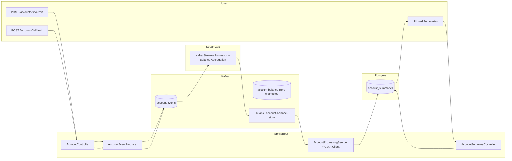

# Agentic Kafka Reference Architecture

## What this is
A production-style reference architecture combining:
- Event-driven microservices (Kafka / Redpanda)
- GenAI (LLM-based reasoning)
- Agentic workflows
- Java + Spring Boot

## Why this exists
Most GenAI examples ignore:
- Throughput
- Idempotency
- Schema evolution
- Streaming consistency

This project shows how to do GenAI *at scale*.

## Architecture
### Architecture Diagram

## Key Concepts
- Kafka Streams (KTable for state)
- LLM-based classification & reasoning
- Agent orchestration (decision → action)
- Avro schemas & evolution
- Failure handling & retries

## Tech Stack
Java, Spring Boot, Kafka, Avro

## Status
Active development – December 2025
