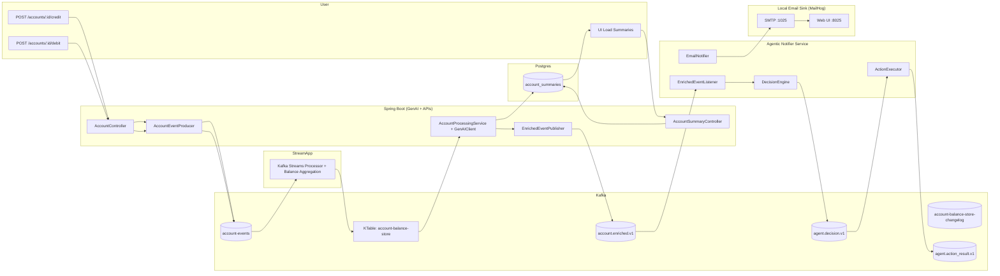
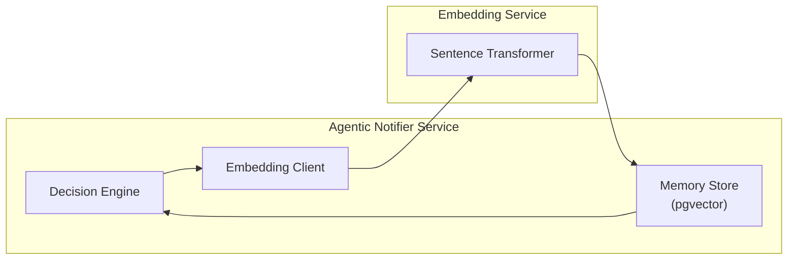

## Architecture
### Architecture Diagram

### Agentic Memory Flow

**Trade-off**
- Dedicated vector DB might be needed at large scale, but Postgres+pgvector is “good enough” for a reference architecture
