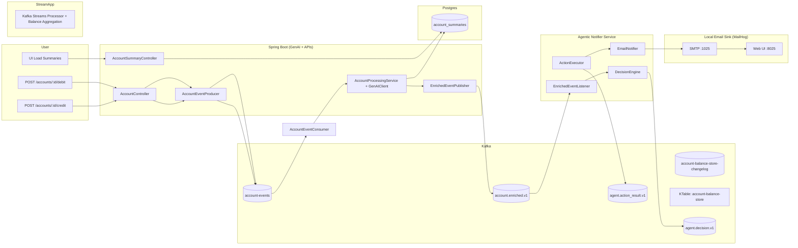
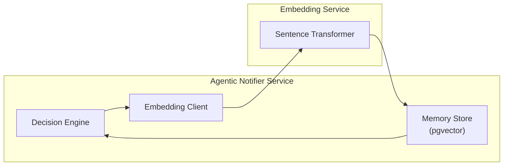

# High-Level Architecture & System Overview

### Implementation note

I intentionally keep a simple consumer-driven balance calc for clarity in the reference implementation. The Kafka Streams KTable is present to show the scalable pattern, and I will align GenAI enrichment to the KTable/changelog in a future iteration.

## How it works (end-to-end flow)

1. **User triggers commands**  
   `POST /accounts/:id/credit` or `POST /accounts/:id/debit` hits `AccountController`.

2. **API produces events (write path)**  
   `AccountEventProducer` publishes account events to Kafka: `account-events`.

3. **Streaming aggregation (state from events)**  
   Kafka Streams aggregates account events into a `KTable (account-balance-store)`, with all state changes durably persisted to the changelog topic `(account-balance-store-changelog)` to enable fault-tolerant recovery and scaling.

5. **GenAI enrichment + materialized read model**  
   `AccountProcessingService + GenAIClient` consumes the aggregated balance view, writes summaries to Postgres
   (`account_summaries`), and publishes enriched events to `account.enriched.v1`.

6. **Fast reads (read path)**  
   The UI loads summaries via `AccountSummaryController` from Postgres (materialized view pattern).

7. **Agentic decision loop**  
   `Agentic Notifier Service` consumes `account.enriched.v1`, makes decisions (`agent.decision.v1`), executes actions,
   and emits results (`agent.action_result.v1`).

8. **Notifications (local dev)**  
   `EmailNotifier` sends emails to MailHog (SMTP :1025, UI :8025) for verification.

## Agentic Memory Flow

## Agentic Memory Flow (embedding-based memory loop)

The Decision Engine can store and retrieve “memory” to improve future decisions:

1. Decision Engine → Embedding Client → Embedding Service (Sentence Transformer)
2. Embeddings stored in Postgres **pgvector**
3. Memory retrieved back into Decision Engine during decision making

**Trade-off**
- Dedicated vector DB might be needed at large scale, but Postgres+pgvector is “good enough” for a reference architecture

## Key ideas
- **Event-driven core:** account changes are immutable events; state is derived via stream processing.
- **CQRS-style split:** writes go to Kafka; reads come from a Postgres materialized view for speed.
- **Replayability:** Kafka topics + changelogged state enable deterministic reprocessing.
- **Agentic automation:** enriched events drive autonomous decisions + actions, with auditable topics.
