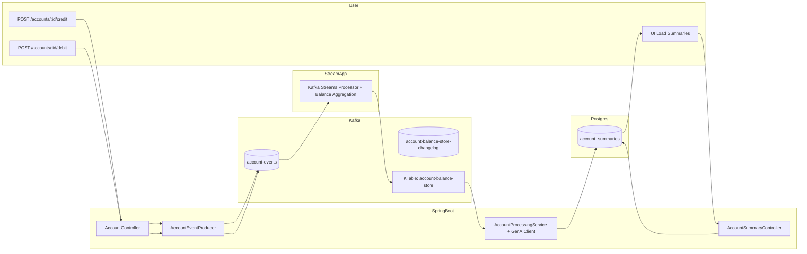
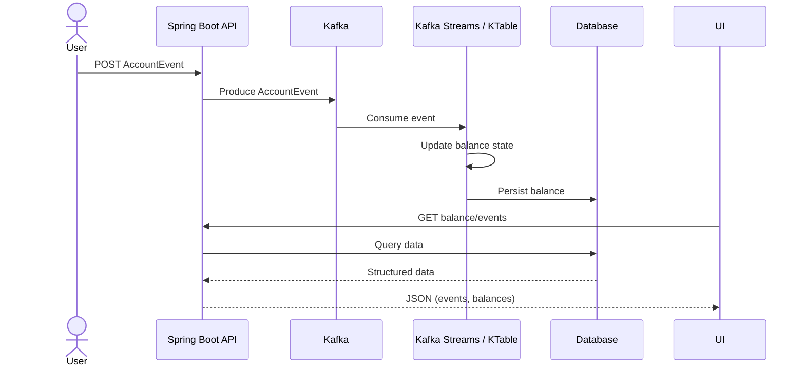
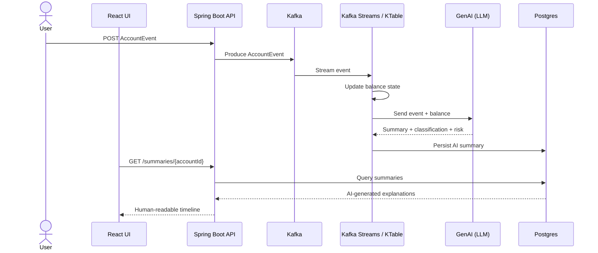

# GenAI + Kafka Streaming POC

Real-time account event processing with Kafka Streams, Avro, GenAI summaries, and a React UI.

This project demonstrates an end-to-end streaming architecture that ingests account events, maintains running balances with Kafka Streams, generates GenAI-based summaries and risk classifications, and stores normalized results in PostgreSQL for querying via a lightweight React frontend.

## Prerequisites

- Docker and Docker Compose installed.
- Java 21.
- Node.js (for the React UI).
- Valid configuration for the GenAI client (e.g., OpenAI API key) set via environment variables or `application.yml` (do not commit secrets).

## Running the Stack

### 1. Start Kafka + Postgres

```bash
docker compose up -d
```
Ensure Kafka, Schema Registry, and Postgres are running:
```bash
docker ps

/agentic-kafka-reference-architecture/kafka-avro-genai-streaming-poc (main)
$ docker ps
CONTAINER ID   IMAGE                                             COMMAND                  CREATED             STATUS             PORTS                                              
NAMES
9e5d40906ecb   confluentinc/cp-enterprise-control-center:7.6.0   "/etc/confluent/dock…"   11 seconds ago      Up 9 seconds       0.0.0.0:9021->9021/tcp                             
control-center
d1fdb7401d49   postgres:16                                       "docker-entrypoint.s…"   About an hour ago   Up About an hour   0.0.0.0:5432->5432/tcp                             
genai_kafka_postgres
224fa756ba1a   confluentinc/cp-schema-registry:7.6.0             "/etc/confluent/dock…"   4 days ago          Up 50 minutes      0.0.0.0:8081->8081/tcp                             
schema-registry
177d914c01cb   confluentinc/cp-kafka:7.6.0                       "/etc/confluent/dock…"   4 days ago          Up 50 minutes      0.0.0.0:9092->9092/tcp, 0.0.0.0:29092->29092/tcp   kafka
524d4ed82e20   confluentinc/cp-zookeeper:7.6.0                   "/etc/confluent/dock…"   4 days ago          Up About an hour   2888/tcp, 0.0.0.0:2181->2181/tcp, 3888/tcp         
zookeeper
```

Services:

- Kafka: `localhost:29092`
- Schema Registry: `localhost:8081`
- Postgres: `localhost:5432`

### 2. Start Spring Boot App

```bash
./gradlew bootRun
```

Backend will be available at `http://localhost:8080`.

### 3. Start React UI

```bash
cd account-ui
npm install
npm run dev
```

Frontend will be available at [http://localhost:5173](http://localhost:5173).

## Testing via REST

### Credit Event

```bash
curl -X POST "http://localhost:8080/accounts/ACC123/credit?amount=50"
```

### Debit Event

```bash
curl -X POST "http://localhost:8080/accounts/ACC123/debit?amount=20"
```

### Check Summaries in Postgres

```bash
docker exec -it genai_kafka_postgres psql -U postgres -d genai_kafka
select * from account_summaries order by id desc;
```

## Testing the UI

1. Keep the Control Center running to monitor incoming messages at runtime. Control Center will be available at [http://localhost:9021](http://localhost:9021):

- Run it in Postman:


- Observe in Control Center:


2. Open `http://localhost:5173` in a browser.
3. Enter `ACC123` as the account ID.
4. Click "Load summaries" to view GenAI-enhanced account history.

## GenAI Behavior Testing

To validate GenAI decisions:

- Normal behavior:

  ```bash
  curl -X POST "http://localhost:8080/accounts/ACC123/credit?amount=50"
  ```

- Suspicious behavior (e.g., negative credit):

  ```bash
  curl -X POST "http://localhost:8080/accounts/ACC123/credit?amount=-10"
  ```

Expected high-level behavior:

- GenAI flags unusual behavior.
- Risk score increases and the summary explains the anomaly.
- The result is stored in Postgres and visible in the UI.


## Technologies Used

- **Backend**
  - Java 21, Spring Boot 3
  - Kafka 7.x (Confluent images) with Schema Registry
  - Avro for schema-based serialization
  - Kafka Streams (KTable) for stateful stream processing
  - PostgreSQL 15 for persisted summaries
- **AI / LLM**
  - Custom `GenAIClient` using OpenAI API (or a local LLM endpoint)
- **Frontend**
  - React + Vite
  - HTTP via axios
- **Infrastructure / Build**
  - Docker Compose for Kafka stack + Postgres
  - Gradle (Kotlin DSL)
- **IDE (optional):** IntelliJ IDEA Community Edition (or any Java IDE)

## Folder Structure

```
kafka-avro-genai-streaming-poc/
├── account-ui/                  # React UI
│   └── src/App.jsx              # UI entrypoint
├── src/main/
│   ├── avro/                    # Avro schemas
│   ├── java/com/viana/poc       # Spring Boot backend
│   │   ├── controller/          # REST endpoints
│   │   ├── entity/              # JPA entities
│   │   ├── repository/          # JPA repositories
│   │   ├── streams/             # Kafka Streams processor (KTable)
│   │   ├── service/             # GenAI + Kafka logic
│   │   ├── genai/               # GenAI client, request/response
│   │   └── constants/
│   └── resources/
│       └── application.yml
├── docker-compose.yml           # Kafka, Zookeeper, Schema Registry, Postgres
├── postgres-data/               # Local Postgres data volume
├── build.gradle.kts
└── settings.gradle.kts
```

## System Architecture

### End-to-end Flow

1. Client sends a credit or debit event via REST to the Spring Boot API.
2. The service serializes the event as Avro and publishes it to the `account-events` Kafka topic.
3. A Kafka Streams KTable maintains a running balance per account from these events.
4. When a balance updates, a downstream component:
   - Calls GenAI to interpret the event and current balance.
   - Produces a summary, classification, and risk score.
   - Persists the result into PostgreSQL.
5. The React UI calls `/summaries/{accountId}` to fetch and display the stored summaries.

### Mermaid Architecture Diagram



## Components

- **Event Producer (`AccountEventProducer`)**
  - Accepts REST requests and publishes Avro-encoded events to `account-events`.
- **Kafka Streams State Store (KTable)**
  - Uses `groupByKey().aggregate(...)` to maintain real-time balances and a changelog topic.
- **Agentic GenAI Processing (`AccountProcessingService` + `GenAIClient`)**
  - Receives event plus computed balance and sends a structured prompt to the LLM.
  - The LLM returns a natural-language summary, behavior classification (e.g., NORMAL / SUSPICIOUS), and risk score, which are persisted in Postgres.
- **UI (React)**
  - Calls `GET http://localhost:8080/summaries/{accountId}` and renders the account's summaries.

# Plain Kafka Pipeline vs GenAI-Enhanced Pipeline
## Plain Kafka pipeline (no GenAI)
A typical Kafka pipeline would produce AccountEvent → consume/process it (e.g., update balance in a KTable or DB) → optionally emit a derived event (e.g., AccountBalanceUpdated), and the UI would read structured data (balances/events) from an API or directly from a materialized store.


## This GenAI-enhanced pipeline 

This pipeline still produces AccountEvent and computes state (balance) via Kafka/KTable, but then it calls an LLM to generate a human-readable summary + classification/risk signal, persists the result to Postgres (account_summaries), and the UI displays a timeline of “explanations” (not just raw events), which is the key difference: **AI adds interpretation on top of the streaming facts**.


## OpenAI / GenAI Setup

This project uses OpenAI’s GPT-4.1-mini model via the Chat Completions API to:

- Summarize each AccountEvent into human-readable text

- Return a simple classification (e.g. NORMAL)

- Return a basic risk score

All of that is done with a single prompt; there is no vector database, no embeddings, no LangChain, and no agent tooling – just a direct LLM call.

## 1. Create an OpenAI account and API key

1. Go to the OpenAI platform and sign in: [https://platform.openai.com](https://platform.openai.com/)
2. Create (or select) a Project.
3. In the left sidebar, go to **API keys** and click **"Create API key"**.
4. Copy the key once and store it somewhere safe – you cannot see it again.

> ⚠️ Treat the API key like a password. **Do not commit it to GitHub**.

## 2. Configure the app to use your API key

You can configure it through environment variables or application.yml.

### Option A – environment variables (recommended)

Set these before starting the Spring Boot app:
openai:
api-key: ${OPENAI_API_KEY}
model: ${OPENAI_MODEL:gpt-4.1-mini}

### Option B – directly in application.yml (for local only)
openai:
api-key: sk-xxxxx...          # do NOT commit this
model: gpt-4.1-mini

### How tokens and pricing work

OpenAI bills based on tokens, not “number of calls”:

A token is a small chunk of text; in English it’s roughly ~4 characters on average (so 100 tokens ≈ 75 words).
OpenAI Platform

Every request uses:

- Input tokens – your prompt and system instructions

- Output tokens – the model’s reply

You pay per token, at different rates for each model; exact prices are on the official pricing page:
https://openai.com/api/pricing

For this project, each event summary call consumes a small prompt (accountId, type, amount, balance) plus the model’s summary text, so token usage per event is usually low.

## 4. Checking your usage and cost

- Go to the Usage page on the OpenAI platform: [https://platform.openai.com/usage](https://platform.openai.com/usage)
- Filter by project and date range to verify the volume of calls from this Kafka+GenAI app.Filter by project and date range to verify the volume of calls from this Kafka+GenAI app.

## About

Experimental POC combining Kafka Streams, Avro, and GenAI for real-time account event summarization and risk classification.
