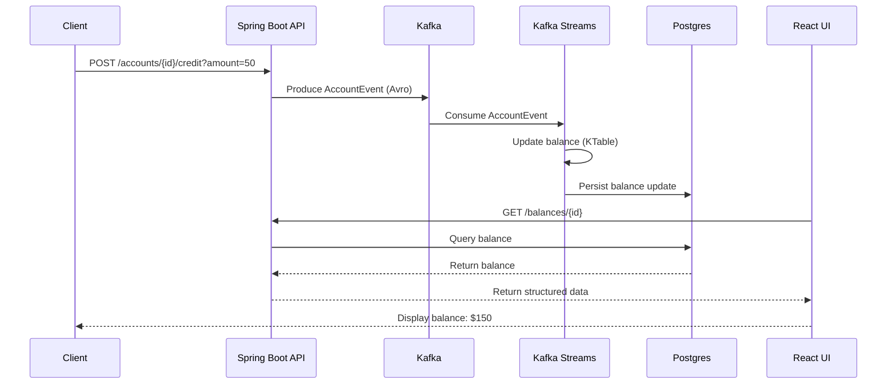
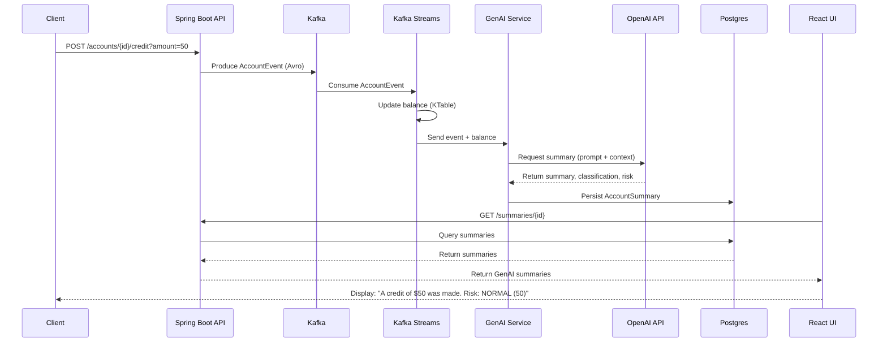

# GenAI + Kafka + Agentic Streaming POC

Real-time account event processing with Kafka Streams, Avro, GenAI summaries, and a React UI.

This project demonstrates an end-to-end streaming architecture that ingests account events, maintains running balances with Kafka Streams, generates GenAI-based summaries and risk classifications, and stores normalized results in PostgreSQL for querying via a lightweight React frontend.

---

## Technologies Used

### Backend

| Component          | Tech                                              |
|--------------------|---------------------------------------------------|
| Runtime            | **Java 21, Spring Boot 3**                        |
| Messaging          | **Kafka 7.x** (Confluent images)                  |
| Schema             | **Avro + Schema Registry**                        |
| Stream Processing  | **Kafka Streams (KTable)**                        |
| Data Store         | **PostgreSQL 15**                                 |
| AI / LLM           | **Custom GenAIClient using OpenAI API (or local)**|
| Build Tool         | **Gradle**                                        |

### Frontend

| Component    | Tech                    |
|--------------|-------------------------|
| UI Framework | **React + Vite**        |
| HTTP         | **axios**               |

### Infrastructure

- Docker Compose (Kafka stack + Postgres)

---

## Folder Structure

```
kafka-avro-genai-streaming-poc/
│
├── account-ui/
│   └── src/App.jsx                # React UI
│
├── src/
│   └── main/
│       ├── avro/                  # Avro schemas
│       │   ├── account-event.avsc
│       │   └── account-event-summary.avsc
│       ├── java/com/viana/poc/    # Spring Boot app
│       │   ├── config/
│       │   ├── controller/        # REST endpoints
│       │   ├── entity/            # JPA entities
│       │   ├── genai/             # GenAI client, request/response
│       │   ├── repository/        # JPA repositories
│       │   ├── service/           # GenAI + Kafka logic
│       │   └── com.viana.poc.constants/
│       └── resources/
│           └── application.yml
│
├── docker-compose.yml             # Kafka, Zookeeper, Schema Registry, Postgres
├── build.gradle.kts
├── settings.gradle.kts
├── gradlew
├── gradlew.bat
│
└── README.md

---

## System Architecture (High-Level)

### End-to-end Flow

1. **User sends a credit or debit event** via REST.
2. Event is **serialized as Avro** and published to Kafka topic `account-events`.
3. **Kafka Streams KTable** maintains a running balance per account.
4. When balance updates, a **downstream consumer**:
   - Calls **GenAI** to interpret the event.
   - Produces a **GenAI summary, classification, and risk level**.
   - **Stores the result in Postgres**.
5. The **React UI** fetches `/summaries/{accountId}` and displays results.

---

## Components Explained

### 1. Event Producer (AccountEventProducer)

- Publishes Avro-encoded event to Kafka topic `account-events`.
- Calls GenAI to generate human-readable summaries.

### 2. Kafka Streams State Store (KTable)

Maintains real-time account balances:

- `groupByKey().aggregate(...)` → state store → changelog topic
- State is recovered on restart.

### 3. GenAI Processing

**AccountProcessingService:**

- Receives the event + computed balance
- Sends a structured request to GenAI

**The AI:**

- Interprets the event
- Generates a natural-language summary
- Classifies behavior (NORMAL / SUSPICIOUS)
- Assigns a risk score
- Saves the result in Postgres

### 4. UI (React)

- Calls backend: `GET http://localhost:8080/summaries/ACC123`
- Displays all summaries for the account

---

## OpenAI / GenAI Setup

This project uses **OpenAI's GPT-4.1-mini** model via the Chat Completions API to:

- Summarize each `AccountEvent` into human-readable text
- Return a simple classification (e.g., `NORMAL`)
- Return a basic risk score

### Create an OpenAI account and API key

#### 1. Go to the OpenAI platform and sign in:

[https://platform.openai.com](https://platform.openai.com/)

#### 2. Create (or select) a Project.

#### 3. Go to "Developer quickstart" and click "Create API key".

#### 4. Copy the key once and store it somewhere safe – you cannot see it again.

⚠️ **Treat the API key like a password. Do not commit it to GitHub.**

### Configure the app to use your API key

You can configure it through environment variables or `application.yml`.

#### Option A – environment variables (recommended)

Set these before starting the Spring Boot app:

```bash
export OPENAI_API_KEY="sk-xxxxx..."
export OPENAI_MODEL="gpt-4.1-mini"
```

Make sure your `application.yml` (or `application.properties`) maps them:

```yaml
openai:
  api-key: ${OPENAI_API_KEY}
  model: ${OPENAI_MODEL:gpt-4.1-mini}
```

#### Option B – directly in application.yml (for local only)

```yaml
openai:
  api-key: sk-xxxxx...  # do NOT commit this
  model: gpt-4.1-mini
```

### How tokens and pricing work

OpenAI bills based on **tokens**, not "number of calls":

- A **token** is a small chunk of text; in English it's roughly **~4 characters** on average (so 100 tokens ≈ 75 words).
- Every request uses:
  - **Input tokens** – your prompt and system instructions
  - **Output tokens** – the model's reply
- You pay per token, at different rates for each model; exact prices are on the official pricing page: [https://openai.com/api/pricing](https://openai.com/api/pricing)

For this project, each event summary call consumes a small prompt (`accountId`, `type`, `amount`, `balance`) plus the model's summary text, so **token usage per event is usually low**.

### Checking your usage and cost

You can see how many tokens you've used and how much you've spent:

1. Go to the **Usage page** on the OpenAI platform: [https://platform.openai.com/usage](https://platform.openai.com/usage)
2. Filter by project and date range to verify the volume of calls from this Kafka+GenAI app.

---

## Plain Kafka Pipeline vs GenAI-Enhanced Pipeline

### Plain Kafka pipeline (no GenAI)

A typical Kafka pipeline would produce `AccountEvent` → consume/process it (e.g., update balance in a KTable or DB) → optionally emit a derived event (e.g., `AccountBalanceUpdated`), and the UI would read structured data (balances/events) from an API or directly from a materialized store.

#### Architecture - Sequence Diagram for a typical Kafka pipeline



### GenAI-Enhanced Pipeline

This pipeline still produces `AccountEvent` and computes state (balance) via Kafka/KTable, but then it **calls an LLM to generate a human-readable summary + classification/risk signal**, persists the result to Postgres (`account_summaries`), and the UI displays a timeline of **"explanations"** (not just raw events), which is the key difference: **AI adds interpretation on top of the streaming facts**.

#### Architecture - Sequence Diagram for the GenAI-enhanced pipeline



---

## End-to-End Testing

### 1. Start the environment

```bash

docker compose up -d
```

You should have:

- Kafka on port **29092**
- Schema Registry on **8081**
- Postgres on **5432**

### 2. Start Spring Boot app

```bash

./gradlew bootRun
```

Runs on `http://localhost:8080`

### 3. Start UI

```bash
cd account-ui
npm install
npm run dev
```

Open browser: `http://localhost:5173`

---

## Testing via REST (Postman or curl)

### Credit event

**curl:**

```bash
curl -X POST "http://localhost:8080/accounts/ACC123/credit?amount=50"
```

**Postman:**

```
POST → http://localhost:8080/accounts/ACC123/credit?amount=50
```

### Debit event

```bash
curl -X POST "http://localhost:8080/accounts/ACC123/debit?amount=20"
```

### Check summaries in Postgres

Inside container:

```bash
docker exec -it genai_kafka_postgres psql -U postgres -d genai_kafka
```

```sql
genai_kafka=# select * from account_summaries order by id desc;
```

---

## Testing the UI

1. Open: `http://localhost:5173`
2. Input: `ACC123`
3. Click **"Load summaries"**

You should see records like:

```
Created: 2025-12-09
Classification: NORMAL (risk: 50)
Summary: A credit of $50 was made...
```

---

## GenAI Behavior Testing

To verify GenAI decisions:

**Normal event:**

```bash
POST /accounts/ACC123/credit?amount=50
```

**Suspicious event (negative amount):**

```bash
POST /accounts/ACC123/credit?amount=-10
```

### Expected behavior:

1. GenAI flags unusual behavior
2. Risk score increases
3. Summary explains anomaly
4. Stored in Postgres
5. Visible in UI

---

## About

Experimental POC combining Kafka Streams, Avro, and GenAI for real-time account event summarization and risk classification.
