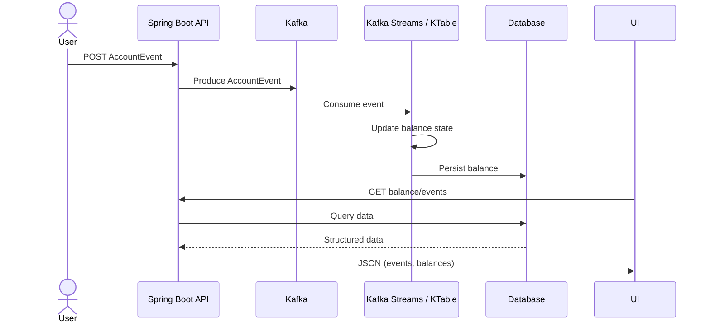
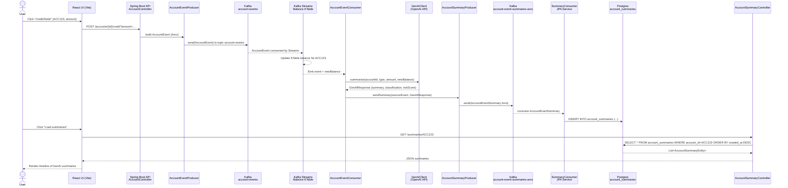

# GenAI + Kafka Streaming POC

Real-time Account Event Processing with GenAI Summaries, Kafka Streams KTable, and React UI

This project is a fully functional end-to-end streaming architecture that ingests account events, computes running balances via Kafka Streams, generates intelligent GenAI summaries, classifies risk behavior, and stores normalized summaries in Postgres.

# A lightweight React UI fetches account summaries to display a human-readable history.

# Technologies Used
## Backend


| Component        | Tech                                                   |
|------------------|--------------------------------------------------------|
| Runtime          | **Java 21, Spring Boot 3**                             |
| Messaging        | **Kafka 7.x** (Confluent images)                       |
| Schema           | **Avro + Schema Registry**                             |
| Stream Processing| **Kafka Streams (KTable)**                             |
| Data Store       | **PostgreSQL 15**                                      |
| AI / LLM         | **Custom GenAIClient using OpenAI API (or local)**     |
| Build Tool       | **Gradle**                                             |


## Frontend

| Component        | Tech                                                   |
|------------------|--------------------------------------------------------|
| UI Framework     | **React + Vite**                                       |
| HTTP             | **axios**                                              |

	
	
### Infrastructure

Docker Compose (Kafka stack + Postgres)

## Folder Structure
```
kafka-avro-genai-streaming-poc/
│
├── account-service/              # Spring Boot app
│   ├── src/main/java/com/viana/poc
│   │   ├── controller/           # REST endpoints
│   │   ├── entity/               # JPA entities
│   │   ├── repository/           # JPA repositories
│   │   ├── streams/              # Kafka Stream processor (KTable)
│   │   ├── service/              # GenAI + Kafka logic
│   │   ├── genai/                # GenAI client, request/response
│   │   └── constants/
│   └── resources/
│       ├── application.yml
│       └── avro schemas
│
├── docker/
│   └── docker-compose.yml        # Kafka, Zookeeper, Schema Registry, Postgres
│
├── account-ui/
│   └── src/App.jsx               # React UI
│
└── README.md
```
# System Architecture (High-Level)
End-to-end Flow

User sends a credit or debit event via REST.

Event is serialized as Avro and published to Kafka topic account-events.

Kafka Streams KTable maintains a running balance per account.

When balance updates, a downstream consumer:

Calls GenAI to interpret the event.

Produces an GenAI summary, classification, and risk level.

Stores the result in Postgres.

The React UI fetches /summaries/{accountId} and displays results.

# Components Explained
### 1. Event Producer (AccountEventProducer)

Publishes Avro-encoded event to Kafka topic account-events.

Calls GenAI to generate human-readable summaries.

### 2. Kafka Streams State Store (KTable)

Maintains real-time account balances:

"groupByKey().aggregate(...)" → state store → changelog topic


State is recovered on restart.

## GenAI Processing

AccountProcessingService:

Receives the event + computed balance

Sends a structured request to GenAI

The AI:

Interprets the event

Generates a natural-language summary

Classifies behavior (NORMAL / SUSPICIOUS)

Assigns a risk score

Saves the result in Postgres

## UI (React)

Calls backend: GET http://localhost:8080/summaries/ACC123

Displays all summaries for the account

# End-to-End Testing
## 1. Start the environment
cd docker
docker compose up -d


You should have:

Kafka on port 29092

Schema Registry on 8081

Postgres on 5432

## 2. Start Spring Boot app
cd account-service
./gradlew bootRun


Runs on http://localhost:8080

## 3. Start UI
$ cd account-ui
$ npm install
$ npm run dev


Open browser:

http://localhost:5173

# Testing via REST (Postman or curl)
Credit event
curl
curl -X POST "http://localhost:8080/accounts/ACC123/credit?amount=50"

Postman

POST → http://localhost:8080/accounts/ACC123/credit?amount=50

Debit event
curl -X POST "http://localhost:8080/accounts/ACC123/debit?amount=20"

Check summaries in Postgres

Inside container:

$ docker exec -it genai_kafka_postgres psql -U postgres -d genai_kafka

genai_kafka=# select * from account_summaries order by id desc;

# Testing the UI

Open:
http://localhost:5173

Input: ACC123

Click Load summaries

You should see records like:

Created: 2025-12-09
Classification: NORMAL (risk: 50)
Summary: A credit of $50 was made...

# GenAI Behavior Testing

To verify GenAI decisions:

Normal event
POST /accounts/ACC123/credit?amount=50

Suspicious event (negative amount)
POST /accounts/ACC123/credit?amount=-10

# OpenAI / GenAI Setup
This project uses OpenAI’s GPT-4.1-mini model via the Chat Completions API to:
Summarize each AccountEvent into human-readable text


Return a simple classification (e.g. NORMAL)


Return a basic risk score

Open 
## Create an OpenAI account and API key
### 1. Go to the OpenAI platform and sign in:
   https://platform.openai.com OpenAI Platform
### 2. Create (or select) a Project.
### 3. Go to Developer quickstart and click “Create API key”. OpenAI Platform
### 4. Copy the key once and store it somewhere safe – you cannot see it again.


⚠️ Treat the API key like a password. Do not commit it to GitHub.

## Configure the app to use your API key
   You can configure it through environment variables or application.yml.
###   Option A – environment variables (recommended)
   Set these before starting the Spring Boot app:
   export OPENAI_API_KEY="sk-xxxxx..."      
   export OPENAI_MODEL="gpt-4.1-mini"

Make sure your application.yml (or application.properties) maps them:
openai:
api-key: ${OPENAI_API_KEY}
model: ${OPENAI_MODEL:gpt-4.1-mini}

### Option B – directly in application.yml (for local only)
openai:
api-key: sk-xxxxx...          # do NOT commit this
model: gpt-4.1-mini

## How tokens and pricing work
   OpenAI bills based on tokens, not “number of calls”:
   A token is a small chunk of text; in English it’s roughly ~4 characters on average (so 100 tokens ≈ 75 words). OpenAI Platform


Every request uses:


Input tokens – your prompt and system instructions


Output tokens – the model’s reply


You pay per token, at different rates for each model; exact prices are on the official pricing page:
https://openai.com/api/pricing OpenAI Help Center


For this project, each event summary call consumes a small prompt (accountId, type, amount, balance) plus the model’s summary text, so token usage per event is usually low.
## Checking your usage and cost
   You can see how many tokens you’ve used and how much you’ve spent:
   ### Go to the Usage page on the OpenAI platform:
   https://platform.openai.com/usage

   ### Filter by project and date range to verify the volume of calls from this Kafka+GenAI app.


# Plain Kafka Pipeline vs GenAI-Enhanced Pipeline
## Plain Kafka pipeline (no GenAI)

A typical Kafka pipeline would produce AccountEvent → consume/process it (e.g., update balance in a KTable or DB) → optionally emit a derived event (e.g., AccountBalanceUpdated), and the UI would read structured data (balances/events) from an API or directly from a materialized store.

### Architecture - Sequence Diagram for a typical Kafka pipeline


### Architecture - Sequence Diagram for the GenAI-enhanced pipeline

This pipeline still produces AccountEvent and computes state (balance) via Kafka/KTable, but then it calls an LLM to generate a human-readable summary + classification/risk signal, persists the result to Postgres (account_summaries), and the UI displays a timeline of “explanations” (not just raw events), which is the key difference: AI adds interpretation on top of the streaming facts.

## Expected behavior:

1. GenAI flags unusual behavior

2. Risk score increases

3. Summary explains anomaly

4. Stored in Postgres

5. Visible in UI