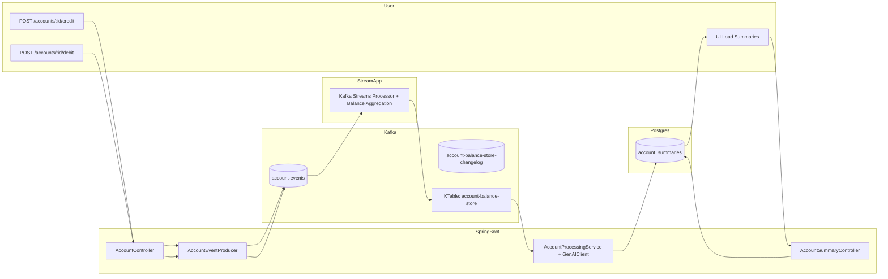

# GenAI + Kafka + Agentic Streaming POC

Real-time account event processing with Kafka Streams, Avro, GenAI summaries, and a React UI.

This project demonstrates an end-to-end streaming architecture that ingests account events, maintains running balances with Kafka Streams, generates GenAI-based summaries and risk classifications, and stores normalized results in PostgreSQL for querying via a lightweight React frontend.

## Technologies Used

- **Backend**
  - Java 21, Spring Boot 3
  - Kafka 7.x (Confluent images) with Schema Registry
  - Avro for schema-based serialization
  - Kafka Streams (KTable) for stateful stream processing
  - PostgreSQL 15 for persisted summaries
- **AI / LLM**
  - Custom `GenAIClient` using OpenAI API (or a local LLM endpoint)
- **Frontend**
  - React + Vite
  - HTTP via axios
- **Infrastructure / Build**
  - Docker Compose for Kafka stack + Postgres
  - Gradle (Kotlin DSL)

## Folder Structure

```
kafka-avro-genai-streaming-poc/
├── account-ui/                  # React UI
│   └── src/App.jsx              # UI entrypoint
├── src/main/
│   ├── avro/                    # Avro schemas
│   ├── java/com/viana/poc       # Spring Boot backend
│   │   ├── controller/          # REST endpoints
│   │   ├── entity/              # JPA entities
│   │   ├── repository/          # JPA repositories
│   │   ├── streams/             # Kafka Streams processor (KTable)
│   │   ├── service/             # GenAI + Kafka logic
│   │   ├── genai/               # GenAI client, request/response
│   │   └── constants/
│   └── resources/
│       └── application.yml
├── docker-compose.yml           # Kafka, Zookeeper, Schema Registry, Postgres
├── postgres-data/               # Local Postgres data volume
├── build.gradle.kts
└── settings.gradle.kts
```
> Note: Rename `settings.gradle.tks` to `settings.gradle.kts` for consistency.

## System Architecture

### End-to-end Flow

1. Client sends a credit or debit event via REST to the Spring Boot API.
2. The service serializes the event as Avro and publishes it to the `account-events` Kafka topic.
3. A Kafka Streams KTable maintains a running balance per account from these events.
4. When a balance updates, a downstream component:
   - Calls GenAI to interpret the event and current balance.
   - Produces a summary, classification, and risk score.
   - Persists the result into PostgreSQL.
5. The React UI calls `/summaries/{accountId}` to fetch and display the stored summaries.

### Mermaid Architecture Diagram



## Components

- **Event Producer (`AccountEventProducer`)**
  - Accepts REST requests and publishes Avro-encoded events to `account-events`.
- **Kafka Streams State Store (KTable)**
  - Uses `groupByKey().aggregate(...)` to maintain real-time balances and a changelog topic.
- **Agentic GenAI Processing (`AccountProcessingService` + `GenAIClient`)**
  - Receives event plus computed balance and sends a structured prompt to the LLM.
  - The LLM returns a natural-language summary, behavior classification (e.g., NORMAL / SUSPICIOUS), and risk score, which are persisted in Postgres.
- **UI (React)**
  - Calls `GET http://localhost:8080/summaries/{accountId}` and renders the account's summaries.

## Prerequisites

- Docker and Docker Compose installed.
- Java 21.
- Node.js (for the React UI).
- Valid configuration for the GenAI client (e.g., OpenAI API key) set via environment variables or `application.yml` (do not commit secrets).

## Running the Stack

### 1. Start Kafka + Postgres

```bash
cd docker
docker compose up -d
```

Services:

- Kafka: `localhost:29092`
- Schema Registry: `localhost:8081`
- Postgres: `localhost:5432`

### 2. Start Spring Boot App

```bash
./gradlew bootRun
```

Backend will be available at `http://localhost:8080`.

### 3. Start React UI

```bash
cd account-ui
npm install
npm run dev
```

Frontend will be available at `http://localhost:5174`.

## Testing via REST

### Credit Event

```bash
curl -X POST "http://localhost:8080/accounts/ACC123/credit?amount=50"
```

### Debit Event

```bash
curl -X POST "http://localhost:8080/accounts/ACC123/debit?amount=20"
```

### Check Summaries in Postgres

```bash
docker exec -it postgres psql -U postgres genai_kafka
select * from account_summaries order by id desc;
```

## Testing the UI

1. Open `http://localhost:5174` in a browser.
2. Enter `ACC123` as the account ID.
3. Click "Load summaries" to view GenAI-enhanced account history.

## Agentic Behavior Testing

To validate GenAI decisions:

- Normal behavior:

  ```bash
  curl -X POST "http://localhost:8080/accounts/ACC123/credit?amount=50"
  ```

- Suspicious behavior (e.g., negative credit):

  ```bash
  curl -X POST "http://localhost:8080/accounts/ACC123/credit?amount=-10"
  ```

Expected high-level behavior:

- GenAI flags unusual behavior.
- Risk score increases and the summary explains the anomaly.
- The result is stored in Postgres and visible in the UI.

## About

Experimental POC combining Kafka Streams, Avro, and GenAI for real-time account event summarization and risk classification.
